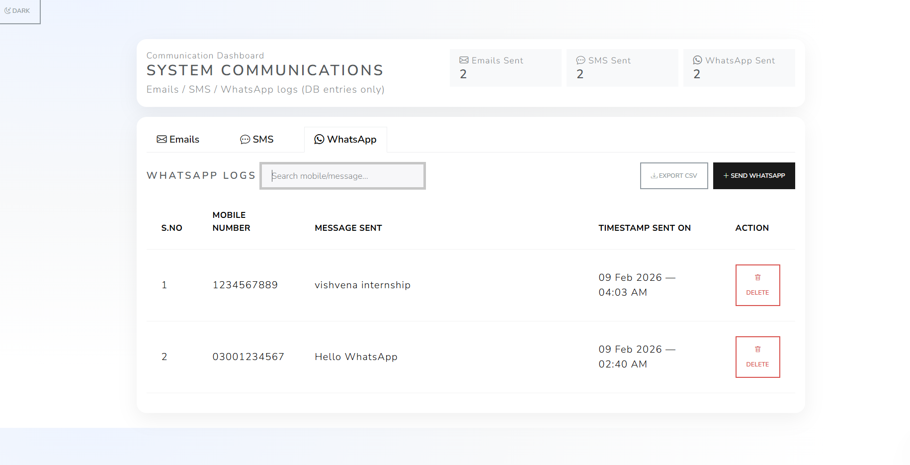
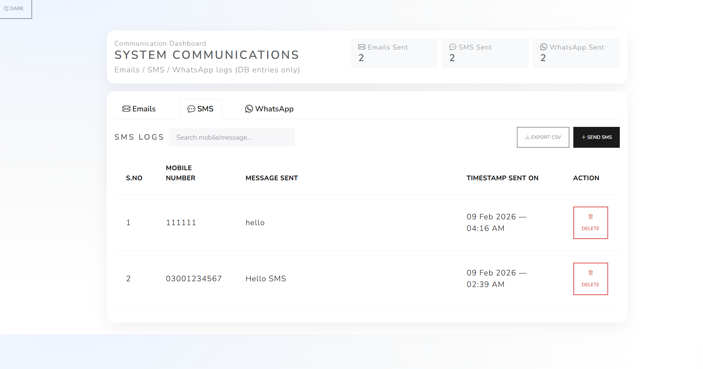
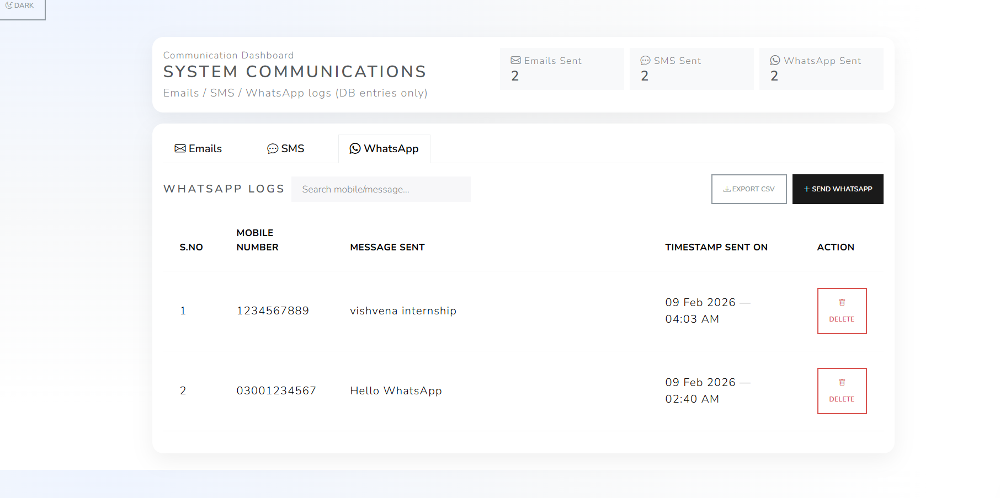

\# System Communication Dashboard
Full Stack Web Application

\## Overview

A full-stack dashboard to log system communications (Email / SMS / WhatsApp).

No real messages are sent — it only stores database entries and displays them in tabbed list views.
Built with a focus on clean UI, structured APIs, and real-world admin dashboard behavior.

\## Demo Video

\- demo/Internship\_task.mp4 (download from this repo)

## Screenshots

### Dashboard

### SMS Logs

### WhatsApp Logs

\## Features

\- Tabs: Emails / SMS / WhatsApp

\- Separate list view columns per channel

\- Modal forms to create logs (AJAX)

\- Toast notifications (success/error)

\- Dashboard counts

\- Search per tab

\- Delete with confirmation

\- Export CSV

## Architecture

Frontend (Bootstrap + JS)
        ↓
PHP API Layer
        ↓
MySQL Database

\## Tech Stack

\- PHP (XAMPP)

\- MySQL

\- Bootstrap + JavaScript (Fetch API)

\## Setup (XAMPP)

1\. Start Apache + MySQL in XAMPP

2\. Create database: `comms\_dashboard`

3\. Import `database.sql` using phpMyAdmin

4\. Put project inside: `C:\\xampp\\htdocs\\comms-dashboard`

5\. Open: http://localhost/comms-dashboard/

\## API Endpoints

\- GET/POST: api/email.php

\- GET/POST: api/sms.php

\- GET/POST: api/whatsapp.php

\- GET: api/stats.php

\- POST: api/delete.php

## Author
Mohammed Ashique Ali
